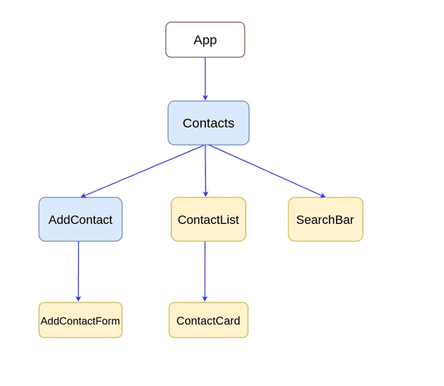

# Ejercicios

1. Implementar una aplicación en React que responda a la arquitectura de componentes definida en la siguiente imagen:

    

2. Implementar las siguientes funcionalidades asociadas a cada componente:

    - **AddContactForm**: Mostrar un formulario con los campos de un contacto (e.g., nombre, email y teléfono) que al hacer click en el botón de Añadir, introduzca un contacto nuevo en la lista de contactos.
    - **ContactList**: Mostrar la lista de contactos en todo momento.
    - **SearchBar**: Mostrar un campo de texto que a medida que se escriba en él, vaya filtrando los contactos a mostrar.

        

3. Implementar las siguientes funcionalidades en la aplicación:

    - Pedir los datos de contactos a la API pública de jsonplaceholder
    - Añadir tres botones al listado de Contactos:
      - Detalle: Permite ver el resto de campos del contacto además del nombre.
      - Editar: Permite cambiar el nombre y otro campo (a elegir) de cada contacto.
      - Eliminar: Permite eliminar el contacto seleccionado.

4. Refactorizar la aplicación para usar Context en aquellos lugares donde proceda.

5. Implementar la funcionalidad de Tema Claro/Oscuro para que el usuario pueda alternar entre ambos aspectos.

6. Añadir a la aplicación un header con un menú siempre presente en todo momento que permita alternar entre dos vistas:

  - Una página de bienvenida con un logo.
  - Una página con el listado de contactos, la barra de búsqueda y un botón para "Añadir contacto".
  
      Al pinchar sobre dicho botón desaparecen el listado y la barra de búsqueda y aparece el formulario de añadir contacto, que debe tener un enlace para volver atrás.

7. Modificar la aplicación para que al pinchar en el botón de Detalle en listado de Contactos, solo se vea la información de dicho contacto, además de un botón para volver Atrás en el listado.

8. Añadir una página de 404 No encontrado.

9. Añadir las siguientes funcionalidades nuevas en la aplicación, relacionadas con una lista de tareas, gestionando los datos de las mismas con Redux:

    - Pedir datos de tareas a la API pública de jsonplaceholder
    - Añadir tres botones al listado de Tareas:
      - Editar: Permite cambiar el nombre y el estado (completada/no completada).
      - Eliminar: Permite eliminar la tarea seleccionada.
    - Añadir un enlace al menú de la aplicación para mostrar la lista de tareas.

10. Añadir la posibilidad de Guardar/Borrar Contactos y Tareas del localStorage.